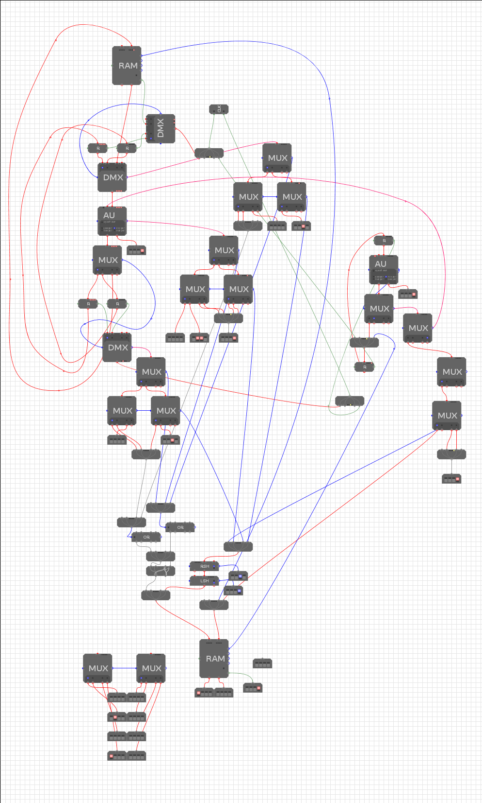
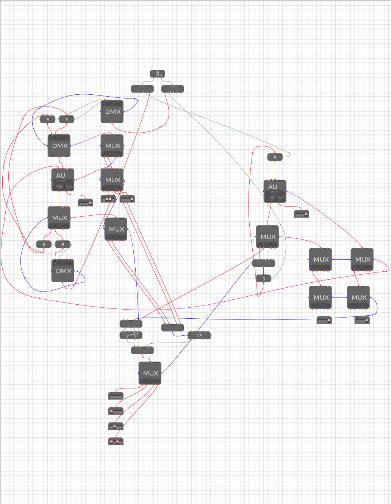

# Counter machine
Implemented in ModuleSim, a simulator for the Bristol-designed build-a-comp modules.
## Instructions
Instructions are 8 bits long. The first 3 most significant bits (MSB) are the
OPCODE which instructs what the machine should do. The next bit stores the
address of a register if that instruction uses register, or otherwise is a zero.
Finally the last 4 least significant bits are used for address where the
instruction requires an address.
### Instruction Table:

| Instruction      | OPCODE                  | Description |
|------------------|-------------------------|-------------|
| INC `r_i`        | `000r_i-0000`           | Increment register `r_i` |
| DEC `r_i`        | `001r_i-0000`           | Decrement register `r_i` |
| JNZ `[ADR]`      | `0100-a_3a_2a_1a_0`     | If `r_0 == 0` then `PC = a_3a_2a_1a_0` |
| STR `r_i, [ADR]` | `100r_i-a_3a_2a_1a_0`   | `MEM[ADR] = r_i` |
| LSR `r_i, [ADR]` | `101r_i-a_3a_2a_1a_0`   | `r_i = MEM[ADR]` |

## Setup
### Decoder
* Shifts are used to get `xCBx` to `xxCB` from the opcode `DCBA`, this is used
  to control the first stage of MUX decoding.
* LSH: `0001`, shift up by one to remove `D` giving `CBA0`
* RSH: `0010`, shift down by two to get `00CB`

#### Input MUX to Central AU
* Lower MUX: `0000`: Register 0
* Upper MUX: `0010`: Memory

#### Output DMUX from Central AU
* Lower  MUX: `0000`: Register 0
* Upper  MUX: `0010`: Memory

### Central AU
* Input B: `0001` (used to increment or decrement registers)

#### AU control
* Lower  MUX: `0000`: Add
* Middle MUX: `0110`: Subtract
* Upper  MUX: `0001`: Pass through

### Program Counter 
* MUX input: `0001`
* Input B: `0001` (used to increment instruction address)

